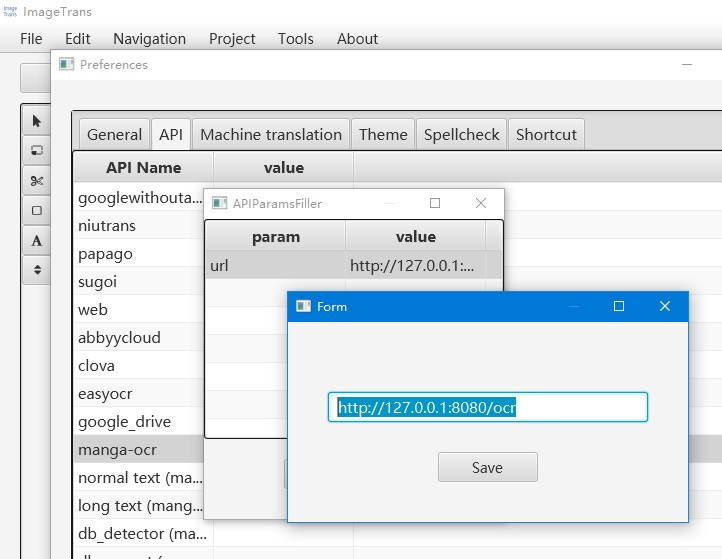

# ImageTrans_plugins

This is the repo for ImageTrans plugins.

Go to the sub folders for details.

You can download all the plugins here: <https://github.com/xulihang/ImageTrans_plugins/releases>

## How to use Sickzil-Machine

1. Download the Windows build of Sickzil-Machine server from [here](https://github.com/xulihang/SickZil-Machine/releases).
2. Download plugins from [here](https://github.com/xulihang/ImageTrans_plugins/releases).
3. Put ExternalInpaintPlugin and ExternalMaskGenPlugin in the plugins folder of ImageTrans
4. Double-click server.exe to run Sickzil-Machine

## Notes Using Local Servers

The default port of local severs is usually 8080. If you are using multiple local servers like mangaOCR and mangaTranslator, they may have a port conflict.

You can modify the Python script to update the port and update the URL in ImageTrans' preferences.

For example, to modify the port of mangaOCR, edit `server_manga_ocr.py` to change to following line:

```py
run(server="paste",host='0.0.0.0', port=8080)   
```

Then, open ImageTrans to update its perferences:

 

