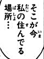
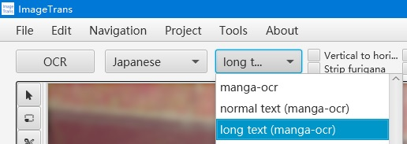

See:

1. <https://github.com/kha-white/manga_ocr>
2. <https://github.com/xulihang/ImageTrans-docs/issues/140>

Note: If your device is powerful enough, it is recommended to use [manga-image-translator](https://github.com/xulihang/ImageTrans_plugins/tree/master/mangaTranslatorOCR).

Install:

1. Install Python3 if it is not installed.
2. Install required packages: `pip3 install bottle==0.12.19 manga_ocr==0.1.4 Paste`. (Use terminal to run the commands.)
3. Download the [model](https://github.com/xulihang/ImageTrans_plugins/releases/download/plugins/manga-ocr-model.zip) and unzip it into a folder.
4. Run the server: `python3 server_manga_ocr.py`.
5. Unzip the [plugin files](https://github.com/xulihang/ImageTrans-docs/files/10887754/manga-ocr-plugin.zip) in ImageTrans's `plugins` folder and restart ImageTrans. (optional for v1.9.0+)

**For convenience**, you can also use the packed versions:
* Windows
   1. Download and unzip [manga-ocr](https://github.com/xulihang/ImageTrans_plugins/releases/download/plugins/manga-ocr.zip).
   2. Download the [model](https://github.com/xulihang/ImageTrans_plugins/releases/download/plugins/manga-ocr-model.zip) and unzip it to manga-ocr's folder in the previous step. (if you do not download the model file, the program will download the model from the Internet.)
   3. Run `run.bat` and wait for the server to get ready.
   If you need to enable GPU, please follow [this guide](GPU.md).
* macOS: https://github.com/xulihang/ImageTrans_plugins/releases/download/plugins/mangaOCR.dmg

## Usage Note

The mangaOCR works great for speech bubbles like the following one:

But it may not work well for the following long text line image by default:

For such a case, you can select the long text mode of the plugin which will crop the long text line images into segments for the OCR engine to extract the text. It should better be used in combination with a scene text detector which detects the text lines accurately like this one: <https://github.com/xulihang/ImageTrans_plugins/tree/master/mangaTranslatorOCR>

## Text Detection Combination

mangaOCR does not detect text. It can be used together with other text detection methods like the following ones:

1. Speech bubble detection models: <https://github.com/xulihang/balloon-dataset>
2. manga image translator (detect text lines): <https://github.com/xulihang/ImageTrans_plugins/tree/master/mangaTranslatorOCR>

## Port Settings

You may need to update the port if you also need to run other local OCR engines:

<https://github.com/xulihang/ImageTrans_plugins/tree/master#notes-using-local-servers>

