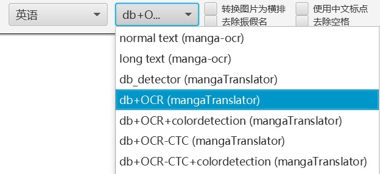

See <https://github.com/xulihang/manga-image-translator>

What does the plugin do:

1. Detect the text lines as a scene text detector.
2. Detect the text lines and recognize the text as an OCR engine.
3. Detect the color of the text. [#issue478](https://github.com/xulihang/ImageTrans-docs/issues/478)
4. Create the text mask and remove the text using inpainting. (You need to have the [ExternalInpaint](https://github.com/xulihang/ImageTrans_plugins/tree/master/ExternalInpaint) and [ExternalMaskGen](https://github.com/xulihang/ImageTrans_plugins/tree/master/ExternalMaskGen) plugins as well. They are included in ImageTrans by default.)

## Installation

### Windwos

1. Download the Windows package of manga-image-translator: [manga-image-translator.zip](https://github.com/xulihang/manga-image-translator/releases/download/packages/manga-image-translator.zip) and unzip it into a folder.
2. Download the model files into the folder in the previous step: [detect.ckpt
](https://github.com/zyddnys/manga-image-translator/releases/download/beta-0.2.1/detect.ckpt), [ocr.ckpt](https://github.com/zyddnys/manga-image-translator/releases/download/beta-0.2.1/ocr.ckpt), [inpainting.ckpt](https://github.com/zyddnys/manga-image-translator/releases/download/beta-0.2.1/inpainting.ckpt)
3. Download and unzip the OCR CTC model into the same folder: [ocr-ctc.zip](https://github.com/zyddnys/manga-image-translator/releases/download/beta-0.3/ocr-ctc.zip). This OCR model supports Korean while the OCR model in the previous step only supports English, Chinese and Japanese. Its speed is also higher.
4. Download the [OCR 48px model](https://github.com/zyddnys/manga-image-translator/releases/download/beta-0.3/ocr_ar_48px.ckpt) and its [dictionary](https://github.com/zyddnys/manga-image-translator/releases/download/beta-0.3/alphabet-all-v7.txt) into the same folder. This OCR model has a higher accuracy.
5. Start the server by running `run.bat`.
6. Put the `mangaTranslatorOCR` plugin files into the `plugins` folder. Get the plugins files: [mangaTranslatorOCRPlugin.zip](https://github.com/xulihang/ImageTrans_plugins/releases/download/plugins/mangaTranslatorOCRPlugin.zip). (not needed for the latest version of ImageTrans)

If you need to enable GPU, please follow [this guide](GPU.md).

### macOS

Install it using this dmg file (for Apple CPU): https://github.com/xulihang/manga-image-translator/releases/download/packages/manga-image-translator.dmg

## Usage

1. It can work as an OCR engine.
   
   Select `db_detector` to detect text lines only and select `db+OCR` to detect text lines and recognize the text as well. If you need to detect the text color, select the one with `colordetection`. If you need to detect the rotation, select the one with `rotationdetection`.

   

2. It can work as a scene text detector.
3. It can be used to generate the text mask and the text-removed image through the external mask generation and inpainting plugins.
4. If you enable text mask generation through OCR and scene text detection in the project settings, it will automatically save the text mask if there has not been a text mask image.

